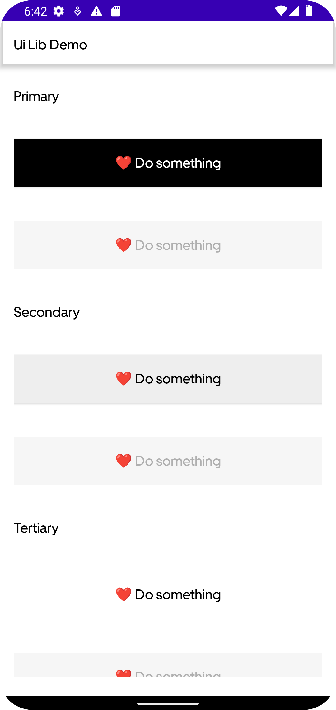

# Uber's Design System (Base) copycat

## What is this?

Is an technical exercise to replicate Uber's system design called `Base`.

All the information about components
is [here](https://www.figma.com/community/file/805195278314519508)

Also check the demo apk (not signed) [here](demo/app-debug.apk)

## Current components

### Colors

#### Primitives

#### Foundation

#### Core

##### Background

##### Content

##### Border

#### Core Extensions

##### Background

##### Content

##### Border

#### Typography

##### Display

##### Heading

##### Label

##### Paragraph

#### Buttons

##### Regular

##### Square

##### Circle

#### Progress Bars

#### Sheet Header

#### Bottom Sheet

## OldKase

[Oldkase](https://github.com/go-cristian/OldKASE) is a copycat library from
airbnb's [showcase](https://github.com/airbnb/Showkase) who helps to create a navigation for your
components. This projects uses this library to expose the UI system as an android App

# License

    Copyright 2021 Cristian Gomez

    Licensed under the Apache License, Version 2.0 (the "License");
    you may not use this file except in compliance with the License.
    You may obtain a copy of the License at

       http://www.apache.org/licenses/LICENSE-2.0

    Unless required by applicable law or agreed to in writing, software
    distributed under the License is distributed on an "AS IS" BASIS,
    WITHOUT WARRANTIES OR CONDITIONS OF ANY KIND, either express or implied.
    See the License for the specific language governing permissions and
    limitations under the License.